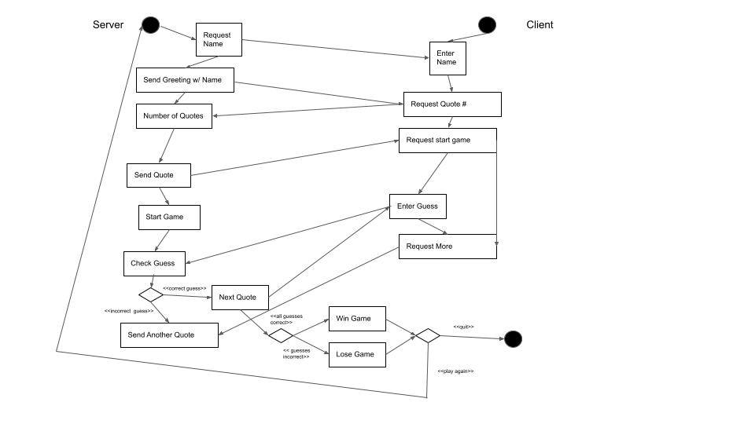

# UDP movie character quote guessing game
This is for the UDP version of the movie quote guessing game.  

## Description

This program is  actually converting all the data to a byte[] and not just sending over the String and letting Java do the rest.

Client connects to server. Server asks Client for their name. The game then starts by providing the player or client a picutre of the first quote from a randomized character selection. The server is on port 8080 and the client has to connect to the server for the game to start. The game is also then displayed on a GUI where the server and client commmunicate. The goal of the game is to guess the movie character that said the quote. The player gets to choose another quote to guess or the quote changes after they get it wrong.

For more details see code and/or video.

## Running the game

`cd udp/`

`For best results run gradle for server before client:`

`gradle runServer`

`gradle runClient`

`type "start" when prompted to start game`

`to end game simply click X at the top right corner of GUI`

### Requirements Fullfilled

*	When the user starts up it should connect to the server. The server will
	reply by asking for the name of the player.

*	The user should send their name and the server should receive it and greet
	the user by name.
	
*	The user should be presented a choice between seeing a leader board or
	playing the game (make the interface easy so a user will know what to do).	

*	If the user chooses to start the game, the server will then send over a first
	quote of a character – you need to print the intended answer in the server terminal
	to simplify grading for us (this will be worth some points).

*	The user enters a guess and the server must check the guess and respond
	accordingly. If the answer is correct then they will get a new picture with a new
	quote (or they might win - see later). If the answer is incorrect they will be informed
	that the answer was incorrect and can try again.

*	If the server receives 3 correct guesses and the timer did not run out (1
	minute), then the server will send a "winner" image (display in UI or open frame
	when using terminal).

*	If the server receives a guess and the timer ran out the user lost and will
	get a "loser" image and message (display in UI or open frame when using terminal).

*	Your protocol must be robust. If a command that is not understood
	is sent to the server or an incorrect parameterization of the command, then the
	protocol should define how these are indicated. Your protocol must have headers
	and optionally payloads. This means in the context of one logical message the
	receiver of the message has to be able to read a header, understand the metadata
	it provides, and use it to assist with processing a payload (if one is even present).

*	Your programs must be robust. If errors occur on either the client or server
	or if there is a network problem, you have to consider how these should be handled
	in the most recoverable and informative way possible. Implement good general error
	handling and output. Your client/server should not crash even when invalid inputs
	are provided by the user.

*	After the player wins/loses they can start a new game by entering their
	name again or they can quit by typing "quit". After entering their name they can
	choose start or the leader board again.

*	If the server receives enough correct answers (based on num questions)
	and the timer did not run out, then the server will send a "winner" image,

*	The server sends out an image at the start, for each pokemon, and for win/lose conditions

*	Images are only know by and handled on the server.

*	Evaluations of the answer happen on the server side, the client
	does not know the questions and their answers.  
   
## Issues in the code that were not included on purpose
The code is basically to show you how you can use a TCP connection to send over different data and interpret it on either side. It focuses on this alone and not on error handling and some nicer features.
It is suggested that you play with this and try to include some of the below for your own practice. 

- Not very robust, e.g. user enters String
- Second client can connect to socket but will not be informed that there is already a connection from other client thus the server will not response
	- More than one thread can solve this
	- can consider that client always connects with each new request
		- drawback if server is working with client A then client B still cannot connect, not very robust
- Protocol is very simple no header and payload, here we just used data and type to simplify things
- Error handling is very basic and not complete
- Always send the same joke, quote and picture. Having more of each and randomly selecting with also making sure to not duplicate things would improve things

# UML Diagram

# UDP

The main differences can be seen in NetworkUtils.java. In there the sending and reading of messages happen. For UDP the max buffer length is assumed to be 1024 bytes. So if the package is bigger it is split up into multiple packages. Ever package holds the information about the following data
     *   totalPackets(4-byte int),  -- number of total packages
     *   currentPacket#(4-byte int),  -- number of current package
     *   payloadLength(4-byte int), -- length of the payload for this package
     *   payload(byte[]) -- payload

Client and server are very similar to the TCP example just the connection of course is UDP instead of TCP. The UDP version has the same issues as the TCP example and that is again on purpose. 

# Screencast: 

- Network: https://www.youtube.com/watch?v=3pspc90CBoo
- Game Running: https://www.youtube.com/watch?v=4wXUVHlr7TA
